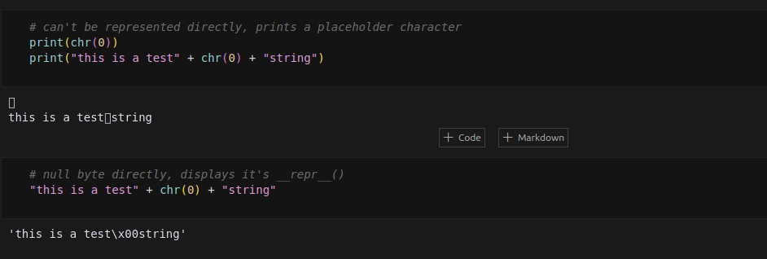

## Assignment 1

---

### Problem (unicode1): Understanding Unicode (1 point)

**(a)** What Unicode character does `chr(0)` return?  
**Answer:** A special character, null byte: `\x00` (`b'\x00'`).

**(b)** How does this character’s string representation (`__repr__()`) differ from its printed representation?  
**Answer:** The null byte can't be represented directly when printed; thus, it's replaced with a placeholder or invisible character, while its string representation explicitly shows as `'\x00'`.

**(c)** What happens when this character occurs in text?  
**Answer:** When the null byte occurs in text, it typically appears as an invisible or placeholder character, and may cause unexpected termination or truncation of text when processed by certain functions.

---

### Problem (unicode2): Unicode Encodings (3 points)

**(a)** What are some reasons to prefer training our tokenizer on UTF-8 encoded bytes, rather than UTF-16 or UTF-32?  
**Answer:** UTF-8 is more memory-efficient, encoding characters in 1-4 bytes as needed, and is also the standard encoding used across the internet, making it the most practical and widely compatible choice compared to the fixed-width encodings UTF-16 and UTF-32.

**(b)** Consider the incorrect decoding function provided. Why is this function incorrect, and provide an example of input producing incorrect results.  
**Answer:** It's incorrect because it decodes the byte string byte-by-byte, causing multi-byte UTF-8 encoded characters to decode incorrectly or not at all. For example, the byte string `b'\xe3\x81\x93'` (UTF-8 encoding of "こ") will trigger a `UnicodeDecodeError` since individual bytes do not represent valid UTF-8 encoded characters alone.

**(c)** Give a two-byte sequence that does not decode to any Unicode character(s).  
**Answer:** A two-byte sequence that doesn't begin with a valid leading byte, e.g., `b'\x81\x93'`, cannot decode into any Unicode character because it lacks the required UTF-8 encoding structure.

---

### Problem (train_bpe_tinystories): BPE Training on TinyStories (2 points)

**(a)** Train a byte-level BPE tokenizer on TinyStories with a vocabulary of 10,000 tokens, including the `<|endoftext|>` special token. Serialize and inspect the resulting vocabulary and merges. How many hours and memory did training take? What is the longest token? Does it make sense?  
**Answer:** Training completed within 2 minutes and used under 30GB RAM. The longest token was the `<|endoftext|>` token, which makes sense as it explicitly delineates the end of texts.

**(b)** Profile your code. What part of the tokenizer training process takes the most time?  
**Answer:** Pretokenization and merging token statistics across multiple data files were the most time-consuming parts of the tokenizer training process.

